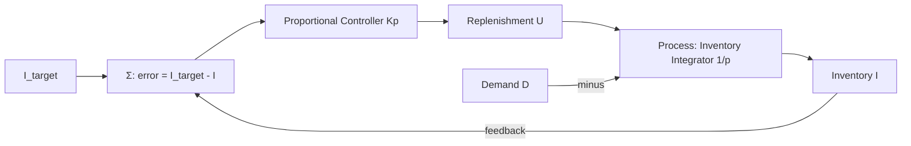

# Task 1 — Linear Control System (ACS) Report

## 1. Scope and Inputs
This report covers the completed portion of Task 1 (Linear ACS). It documents the linear control model, transfer functions, and stability assessment computed from the current implementation of the inventory control system.

**Inputs used in code (for reproducibility):**
- Proportional gain $K_p = 1.0$
- Target inventory $I_{target} = 1.0$

**Computed artifact:**
- Linear ACS computation output: [docs/reports/artifacts/2026-02-01/linear_control_analysis.txt](docs/reports/artifacts/2026-02-01/linear_control_analysis.txt)

## 2. ACS Structural Diagram (Conceptual)
**for review** — Conceptual structure for the inventory ACS (feedback loop):

Interpretation:
- **Controller ($G_c$):** replenishment policy (e.g., order-up-to) that sets $U(t)$ proportional to the inventory deficit.
- **Process ($G_p$):** conservation of mass in the warehouse; inventory is the time-integral of net inflow $U(t)-D(t)$.
- **Disturbance ($D$):** hourly sales rate from the dataset that depletes inventory.
- **Feedback loop:** attempts to restore $I(t)$ to $I_{target}$ under stochastic demand.

## 3. Element Transfer Functions (Linear Approximation)
**for review** — Linearized elements used in the model:

- **Process (inventory integrator):**
	$$I(p) = \frac{1}{p}\bigl(U(p) - D(p)\bigr)$$
	Transfer from $U$ to $I$: $$G_p(p) = \frac{1}{p}$$

- **Controller (proportional):**
	$$U(t) = K_p\bigl(I_{target} - I(t)\bigr)$$
	Transfer from error $E(p)$ to $U(p)$: $$G_c(p) = K_p$$

- **Lead time (delay) approximation (optional):**
	$$G_d(p) = e^{-Lp} \approx \frac{1 - \frac{Lp}{2}}{1 + \frac{Lp}{2}}$$

Assumption: demand $D(p)$ is treated as a disturbance input; the closed-loop transfer below is from $I_{target}$ to $I$.

## 4. Overall Closed-Loop Transfer Function
Combining $G_c(p)$ and $G_p(p)$ with unity feedback, the closed-loop transfer from $I_{target}$ to $I$ is:

The open-loop transfer function is $W_{open}(p) = \frac{1}{p}$. With unity feedback and $K_p=1$, the closed-loop transfer function is:

$$W(p) = \frac{P(p)}{Q(p)} = \frac{1}{p + 1}$$

$$W(p) = \frac{G_c(p)G_p(p)}{1 + G_c(p)G_p(p)} = \frac{K_p \cdot (1/p)}{1 + K_p \cdot (1/p)} = \frac{K_p}{p + K_p}$$

**Characteristic equation:**
$$Q(p) = p + K_p = 0$$

The root is $p=-1$, indicating asymptotic stability.

## 4b. Disturbance Transfer Function (Demand Rejection)
For SCM, the key response is to demand $D(p)$. With negative feedback and disturbance at the plant input:

$$G_{DI}(p) = \frac{I(p)}{D(p)} = -\frac{G_p(p)}{1 + G_c(p)G_d(p)G_p(p)}$$

For $L=0$ (no delay):

$$G_{DI}(p) = -\frac{1}{p+K_p}$$

## 5. Stability Analysis
The system is stable if all closed-loop poles have negative real parts. For $W(p) = \frac{K_p}{p + K_p}$, the pole is at $p = -K_p$.

**Stability condition:**
$$K_p > 0 \Rightarrow \Re(p) < 0$$

Therefore, any positive proportional gain yields a stable first-order closed-loop response.

## 6. Computed Results (from code)
Using the current configuration ($K_p = 1.0$):

- Reference tracking (no delay): $W(p) = \frac{1}{p + 1}$ with pole $p=-1$ (stable).
- Disturbance response (no delay): $G_{DI}(p) = -\frac{1}{p + 1}$ with pole $p=-1$ (stable).
- Lead time scenario ($L=2$, Padé 1st order):
	- $W(p) = \frac{p-1}{p^2 + 2p - 1}$
	- Poles: $p \approx -2.414,\; 0.414$ (unstable due to positive pole)

See the recorded outputs in [docs/reports/artifacts/2026-02-01/linear_control_analysis.txt](docs/reports/artifacts/2026-02-01/linear_control_analysis.txt).

## 7. Recommendations and Next Steps
1. **Finalize structural diagram** with domain-specific labels (inventory units, time scale) and confirm sign conventions for the disturbance path (**for review**).
2. **Add interpretive notes** for each element (controller, integrator, disturbance) and relate to the supply-chain context (**for review**).
3. **Consider parameter selection**: test multiple $K_p$ values to show stability margin and response speed (rise time, settling time).
4. **Document disturbance response** (transfer from $D$ to $I$) to describe stockout sensitivity.
5. **Add lead time scenario** using Padé delay approximation and show how stability margin decreases with larger $L$.
6. **Integrate results into final PDF report** with a short narrative for Task 1.

## 8. Conclusion
The linear ACS model for inventory control is fully specified with a proportional controller and integrator process. The resulting closed-loop transfer function $W(p) = \frac{K_p}{p + K_p}$ yields a single pole at $p = -K_p$, ensuring stability for any $K_p > 0$. The computed artifact confirms stability for the current configuration and provides concrete values to reference in the final report.

## 9. Introduction
This section documents the linear automatic control system (ACS) formulation for the inventory dynamics of the doctoral research object. The goal is to provide a clear control-theoretic representation, derive the necessary transfer functions, and establish stability criteria to support subsequent nonlinear and chaos analyses in the broader assignment.
